# **Advanced Lane** 
---

Pongrut Palarpong  
May 03, 2018

---

**Advanced Lane Finding Project**

The goals / steps of this project are the following:

* Compute the camera calibration matrix and distortion coefficients given a set of chessboard images.
* Apply a distortion correction to raw images.
* Use color transforms, gradients, etc., to create a thresholded binary image.
* Apply a perspective transform to rectify binary image ("birds-eye view").
* Detect lane pixels and fit to find the lane boundary.
* Determine the curvature of the lane and vehicle position with respect to center.
* Warp the detected lane boundaries back onto the original image.
* Output visual display of the lane boundaries and numerical estimation of lane curvature and vehicle position.

[//]: # (Image References)

[image1]: ./examples/undistort_output.png "Undistorted"
[image2]: ./test_images/test1.jpg "Road Transformed"
[image3]: ./examples/binary_combo_example.jpg "Binary Example"
[image4]: ./examples/warped_straight_lines.jpg "Warp Example"
[image5]: ./examples/color_fit_lines.jpg "Fit Visual"
[image6]: ./examples/example_output.jpg "Output"
[video1]: ./project_video.mp4 "Video"

## [Rubric](https://review.udacity.com/#!/rubrics/571/view) Points

### Here I will consider the rubric points individually and describe how I addressed each point in my implementation.  

---

### Writeup / README

#### 1. Provide a Writeup / README that includes all the rubric points and how you addressed each one.  You can submit your writeup as markdown or pdf.  [Here](https://github.com/udacity/CarND-Advanced-Lane-Lines/blob/master/writeup_template.md) is a template writeup for this project you can use as a guide and a starting point.  

You're reading it!

### Camera Calibration

#### 1. Briefly state how you computed the camera matrix and distortion coefficients. Provide an example of a distortion corrected calibration image.

The code for this step is contained in Step 3: LaneFinder Class, to execute just call camera_calibration function for calibrate camara. See example at Step 4 of the IPython notebook located in "./Advanced-Lane-Lines.ipynb".

I start by preparing "object points", which will be the (x, y, z) coordinates of the chessboard corners in the world. Here I am assuming the chessboard is fixed on the (x, y) plane at z=0, such that the object points are the same for each calibration image.  Thus, `objp` is just a replicated array of coordinates, and `objpoints` will be appended with a copy of it every time I successfully detect all chessboard corners in a test image.  `imgpoints` will be appended with the (x, y) pixel position of each of the corners in the image plane with each successful chessboard detection.  

I then used the output `objpoints` and `imgpoints` to compute the camera calibration and distortion coefficients using the `cv2.calibrateCamera()` function.  I applied this distortion correction to the test image using the `cv2.undistort()` function and obtained this result: 

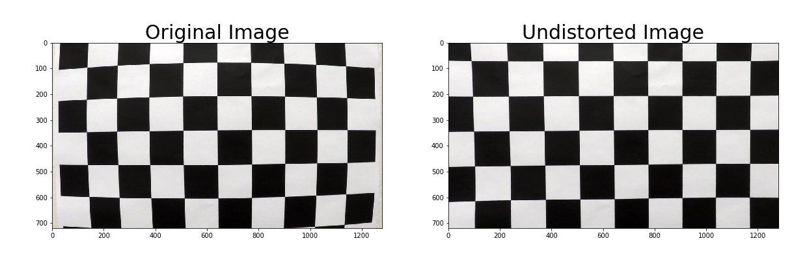


### Pipeline (single images)

#### 1. Provide an example of a distortion-corrected image.

This step uses the load calibration coefficients that were generated during camera calibration to do distortion correction.
I apply the distortion correction to the test image the result look like this one which the code is in Step 5.1 of the IPython notebook:
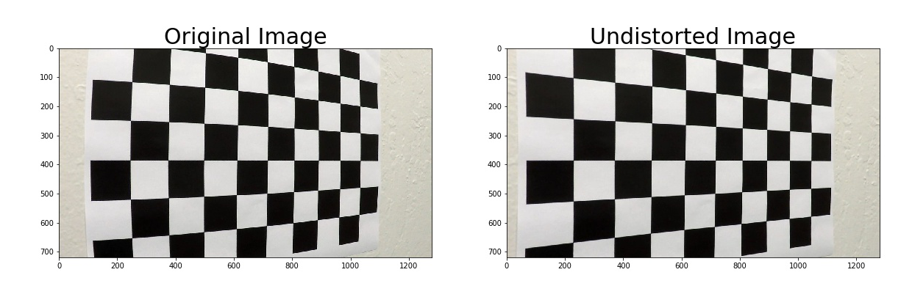

#### 2. Describe how (and identify where in your code) you used color transforms, gradients or other methods to create a thresholded binary image.  Provide an example of a binary image result.

At Step 5.2 of the IPython notebook, I used a combination of color and gradient thresholds to generate a binary image.  Here's an example of my output for this step.  

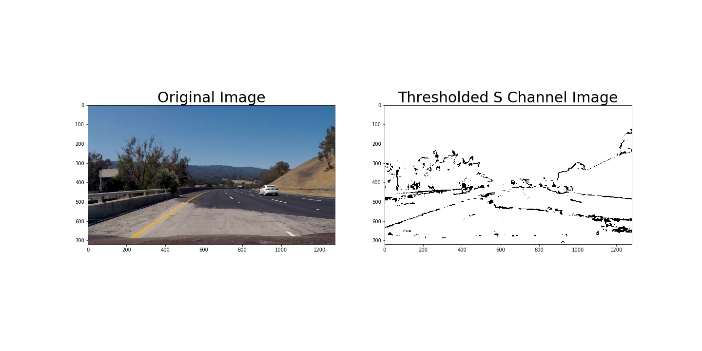


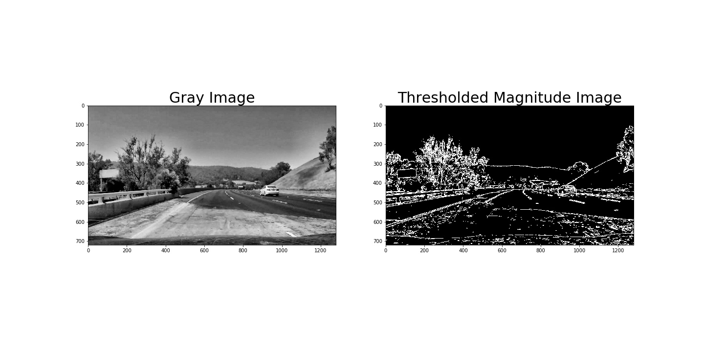
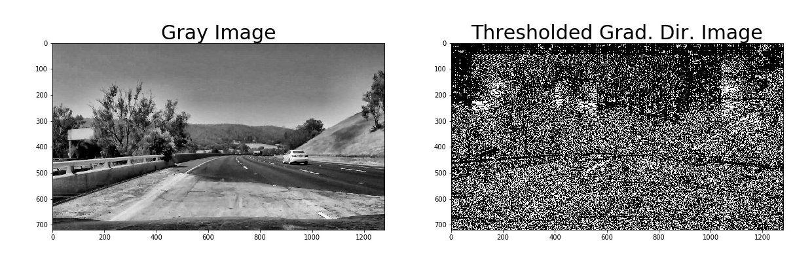
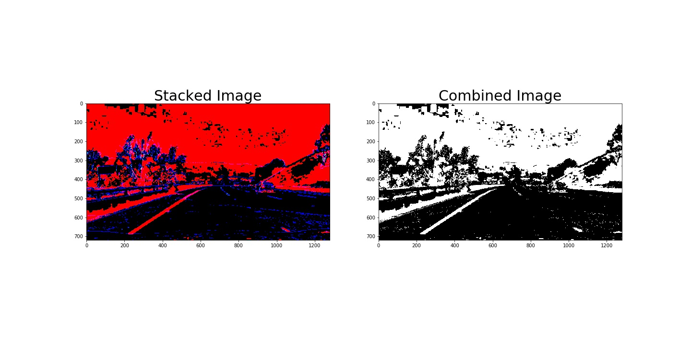

#### 3. Describe how (and identify where in your code) you performed a perspective transform and provide an example of a transformed image.

The code for my perspective transform includes a function called `per_trans_calibrate() and perspective_trans()`, which appears in Step 5.3 in the IPython notebook).  The `per_trans_calibrate()` function to automatically find perspective transformation parameters as a starting points then I can manually finetune the source and destination parameters.

The `per_trans_calibrate()` function takes as inputs an image (`img`), as well as source (`src`) and destination (`dst`) points. I chose the hardcode the source and destination points in the following values:

```python
def find_perspective_dst(self, best_lines, offset=200):
    """Function to calculate perspective transformation source & destination parameters.

      Args:
        best_lines (array): two best lines for automatically finding src & dst points.
        offset (int)      : offset pixels of x axis.

      Return:
        src (array)       : source parameter.
        dst (array)       : destination parameter.
    """    
    # extract points of first line.
    # bottom left point of first line.
    bl1 = best_lines[0][np.argmin(best_lines[0][0])]
    # top left point of first line.
    tl1 = best_lines[0][np.argmax(best_lines[0][0])]
    # top right point of second line.
    tr1 = best_lines[1][np.argmin(best_lines[1][0])]
    # bottom right point of second line.
    br1 = best_lines[1][np.argmax(best_lines[1][0])]
    # generate src points from hough lines.
    src = np.float32([bl1, tl1, tr1, br1])
    # extract x & y data.
    xs = best_lines[:,:,0]
    ys = best_lines[:,:,1]
    # find minimum point in x axis.
    left = xs.min()
    # find maximum point in x axis.
    right = xs.max()
    # define top destination at zero.
    top = 0
    # find maximum point in y axis.
    buttom = ys.max()
    # generate dst points.
    bl2 = (left+offset, buttom)
    tl2 = (left+offset, top)
    tr2 = (right-offset, top)
    br2 = (right-offset, buttom) 
    dst = np.float32([bl2, tl2, tr2, br2])
    return src, dst
        
# predefined perspective transformation source parameter.
self.default_src = np.float32([(203, 720), (571, 468), (711, 468), (1109, 720)])
# predefined perspective transformation destination parameter.
self.default_dst = np.float32([(318, 720), (318, 0), (994, 0), (994, 720)])
```

This resulted in the following source and destination points:

| Source        | Destination   | 
|:-------------:|:-------------:| 
| 203, 720      | 318, 720      | 
| 571, 468      | 318, 0        |
| 711, 468      | 994, 0        |
| 1109, 720     | 994, 720      |

I verified that my perspective transform was working as expected by drawing the `src` and `dst` points onto a test image and its warped counterpart to verify that the lines appear parallel in the warped image.

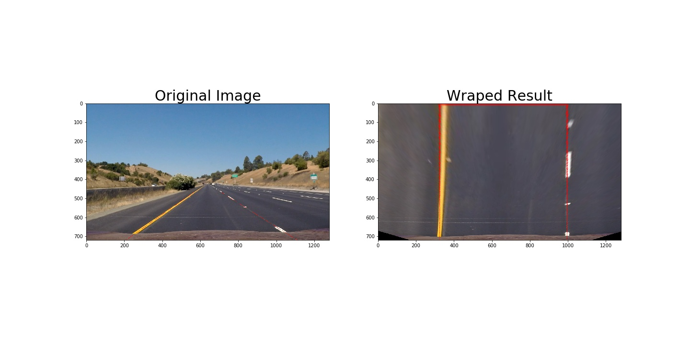

#### 4. Describe how (and identify where in your code) you identified lane-line pixels and fit their positions with a polynomial?

The Step 5.4 [block #1], I started by selecting the region of interest by color filtering and then load the default src & dst parameters for passing to `perspective_trans ()` function. After I got  wraped image (top view) then I used this image to go through the binary transformation process. The last step is to  trim 50 pixels at left & right edges.
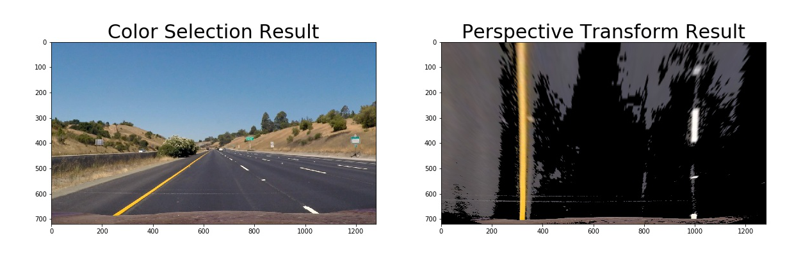


The Step 5.4 [block #2], I search for the histogram peaks to get the basex position of both left & right.
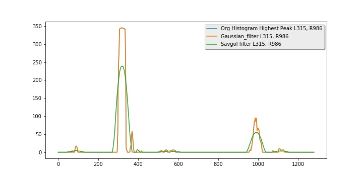

The Step 5.4 [block #3], Then I used the `sliding_search ()` function to detect and store the white pixels in the left and right base_x guides. And use position of these white pixels and fit my lane lines with a polynomial 2nd order kinda like this:


#### 5. Describe how (and identify where in your code) you calculated the radius of curvature of the lane and the position of the vehicle with respect to center.

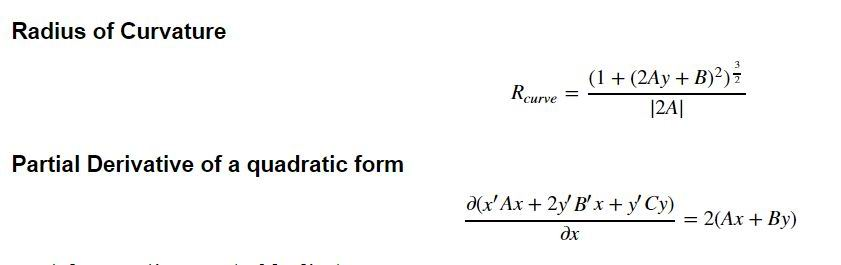

In Step 2 `Line ()` Class I have `get_radius_curv ()` to convert the polynomial of the pixel unit to meter unit and `get best radius ()` to find the average of the last 6 radius of curvature.

```
def get_radius_curv(self, fitx):
    """Helper function to calculate new polynomials fit in meter-based (world space).

    """
    line_fit_cr = np.polyfit(self.ploty*self.ym_per_pix, fitx*self.xm_per_pix, 2)
    return line_fit_cr

def get_best_radius(self):
    """Helper function to calculate and return average radius of curvature.

    """
    return np.mean(self.radius_of_curvature.get())
```   

Code block below shows, how I calculate recent radius of curvature and partial derivative to find x direction. 
```
# calculate the best fit of second order polynomial in meter based.
line_fit_cr = self.get_radius_curv(fitx)
# calulate current radious of curvature in meter based.
current_radius_of_cur = ((1 + (2*line_fit_cr[0]*y_eval*self.ym_per_pix + \
                                     line_fit_cr[1])**2)**1.5) / np.absolute(2*line_fit_cr[0])
# update new radious of curvature value.
self.update_radius(current_radius_of_cur)
# calculate the partial derivative at x min and y=0 >> 2*(A*x + B*y) 
# note: https://math.stackexchange.com/questions/1845877/partial-derivative-of-a-quadratic-form
partial_dx = np.round((2*line_fit[0]*fitx[0])+(2*line_fit[1]*self.ploty[0]), 2)
```


#### 6. Provide an example image of your result plotted back down onto the road such that the lane area is identified clearly.

I implemented this in Step 5.6 of the IPython notebook located in "./Advanced-Lane-Lines.ipynb" in the function `find_lane()` and `draw_vehicle_dashboard()` function to draw dashboard for indicating related information.The bottom of the image shows the distance between the center of the image and the center of the lane. The circle gauge at the top right shows the radius of curvature in kilometers. The edge of the circle shows the direction of the curve in the left or right. The color of the circle indicates the speed of the circle. If the green is able to use speed up to about 80 mph, yellow is 65 mph and red is 55 mph. [Horizontal Curvature of High-Speed Highways and Connecting Roadways with Superelevation](http://onlinemanuals.txdot.gov/txdotmanuals/rdw/horizontal_alignment.htm#BGBHGEGC)<br/>
Here is an example of my result on a test image:

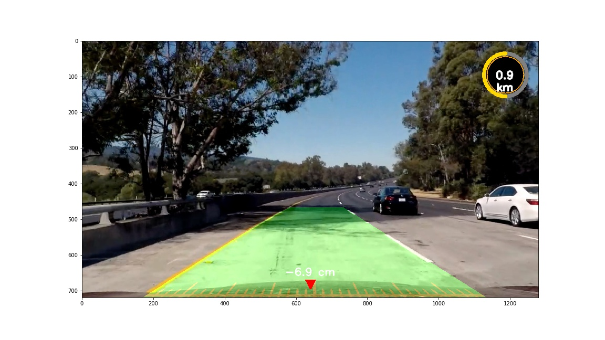

---

### Pipeline (video)

#### 1. Provide a link to your final video output.  Your pipeline should perform reasonably well on the entire project video (wobbly lines are ok but no catastrophic failures that would cause the car to drive off the road!).

Here's a [link to my video result](./project_video.mp4)

---

### Discussion

#### 1. Briefly discuss any problems / issues you faced in your implementation of this project.  Where will your pipeline likely fail?  What could you do to make it more robust?

Here I'll talk about the approach I took, what techniques I used, what worked and why, where the pipeline might fail and how I might improve it if I were going to pursue this project further.  
